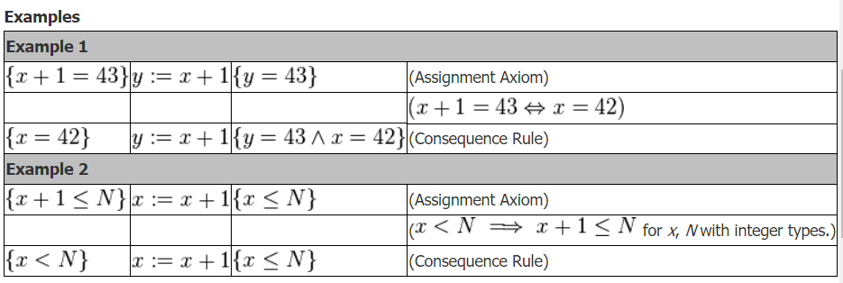
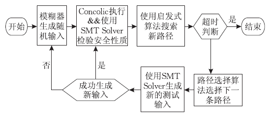

# 关于软件安全漏洞检测技术的调研

 

## 一、  引言

互联网时代，任何能接触到互联网的人都离不开各种各样的软件，可以说，软件已经成为了日常生活中的一部分。从电脑软件到手机app，再到新兴的物联网设备、只能设备等，软件逐步扩大了其在日常生活中的覆盖范围，软件安全也越来越影响到了生活中的方方面面，可以将其比作是软件产品的生命线。 然而，如今的软件工程实践中却充斥着漏洞百出的劣质产品，这些劣质产品严重影响到了个人、集体、乃至整个社会的利益。以美国为例，软件方面的故障每年会在美国造成几十亿美金的经济损失[[1\]](#_ftn1)，其危害性有时候几乎是无法估量的。

由此，软件的安全漏洞检测就成为了一项不可或缺的技术。安全漏洞检测技术是提高软件质量和安全性、减少软件安全漏洞的重要方法和基本手段。优秀的软件安全漏洞检测技术不仅仅可以防止漏洞被攻击者利用，还可以在漏洞万一被利用的情况下及时做出响应，甚至能够反向追踪攻击者，达到减少损失、寻找不法分子这样一石二鸟的效果。

那么，软件安全漏洞检测技术究竟有哪些呢？本文将首先梳理常见的漏洞类型，再列举一些传统的检测技术，并对这些技术进行学术意义上的划分，介绍它们的主要工作原理和工作流程、应用领域等等；接着会介绍一些近年来新出现的检测技术或是未来可能出现的检测技术的发展方向，指出其面临的挑战和发展趋势等。

 

## 二、  常见的软件安全漏洞

计算机中存在的安全漏洞主要有：操作系统安全漏洞、网络协议安全漏洞、数据库安全漏洞、网络软件安全漏洞等。[[2\]](#_ftn2)

### （一）操作系统安全漏洞

操作系统是计算机硬件系统之上的第一层软件，是确保各种应用操作的支撑平台。目前各大操作系统都有一定的缺陷，尚未达到完美，且由于更新换代的速度加快，新功能不断引入，新型漏洞出现的同时旧漏洞常常不能及时维护，出现了更多的安全问题。Windows系统这些年就常常处于各类漏洞的威胁之下，2017年9月以来，Windows SMB协议中的一个缺陷使得已被平息的蠕虫病毒WannaCry又拥有了可乘之机，攻击事件不断增加，并在2018年4月达到了新的高峰，甚至超过了勒索病毒爆发最严重的时候。随后，2018年5月，Windows系统又被牵扯进了Intel芯片重大安全问题的事件之中，受到了Meltdown熔断、Spectre幽灵两大处理器安全漏洞的影响，同时遭受严重影响的还有众多Linux系统。这些操作系统级别的安全漏洞会对用户造成极大的安全隐患，威胁到个人的财产和生命安全。

操作系统的安全漏洞大体可分为四种：非法访问、访问控制严重失调、操作系统陷门，以及不完全中介。

### （二）网络协议安全漏洞

TCP/IP协议的目的在于确保传输安全、可靠，并经来回确认来提高数据的真实性。而TCP/IP未能形成相应的内在控制机制，无法鉴别网络中的源地址，因而也就无法判断IP的来源，这即为TCP/IP漏洞产生的根本原因。黑客根据侦听方式可将网络数据截获，通过检查数据可将TCP系列号推测出来，而后再传输路由，达到数据破坏之目的。

2017年6月，在德州奥斯丁举行的USENIX安全研讨会上，加州大学河滨分校研究生报告了一个严重的TCP协议边信道漏洞（PDF）[[3\]](#_ftn3)，该漏洞允许攻击者远程劫持任意两主机之间的会话。该漏洞影响了Linux 3.6+内核，会严重威胁到信息的机密性。

### （三）数据库安全漏洞

数据库安全漏洞是Web应用中最大的威胁者，是对用户输入过于信任。用户输入主要是由HTML表单中所提交的参数组成。假如无法查验该类参数的合法性，人为地操作失误或计算机病毒便会破坏数据库，甚至非法入侵数据库，给服务器带来安全隐患。

比较常见的一种攻击方式是SQL注入，即通过把SQL命令插入到Web表单提交、输入域名或页面请求的查询字符串，最终能够达成执行任意SQL命令的效果。一般可以通过SQL指令“and”来判断是否存在注入点，再猜测表名、列名等，获取表格的格式或是管理员的账号和密码，以仿冒管理员的身份登录，上传恶意文件获取服务器的控制权。

SQL注入可能导致的一个直接后果就是数据泄露。在ArsTechnica的一篇文章中，Goodin提到美国海军花费了超过50万美元（超过300万人民币）来处理一次数据泄露事故[[4\]](#_ftn4)。而在NTT集团发布的2014年全球威胁情报报告中则指出——企业对一次小规模SQL注入攻击的平均善后开支，通常超过19万6千美元（超过120万人民币）。2014年的一份报告中显示，从一个月内全球发生的30万起攻击事件中抽样出的数据中，SQL注入攻击占比达到了24.6%。足可见SQL注入的危害之大。

### （四）网络软件安全漏洞

网络软件主要有下列几种安全漏洞：1）匿名FTP。2）电子邮件中出现的安全漏洞，电脑黑客此时可在该系统中加入编码电脑病毒，从而控制网络用户。3）域名服务：域名是自己与用户连接的生命线，只有成功注册“生命网”并拥有其相似域名，用户的权益才能得到保障。然而，现实中“生命网”出现的漏洞不胜枚举，很多用户对之束手无策。4）Web编程人员在CGI、PHP等程序编写时出现了问题，使系统结构或者是服务目录变成可读写形式，为黑客入侵创造了条件。

上述几种安全漏洞中，FTP协议是一个早已过时的协议，即使在不匿名的模式下使用也非常危险。2017年时美国曾经发生过一系列针对民众的匿名FTP攻击事件，美国联邦调查局称恶意黑客利用匿名FTP服务器漏洞入侵了小型医疗机构与牙科诊所，获取医疗记录和其他敏感私人信息，并以此进行骚扰、恐吓、勒索甚至欺诈。对于采用了不同协议的网站服务器而言，应当及时注意协议的版本更新，弃用不安全的版本，及时阻断黑客利用旧版本协议的漏洞发起攻击的可能性。其实要摆脱匿名FTP服务是非常简单的一件事，仅需花费数分钟更改服务器设置即可。

 

## 三、  软件安全漏洞检测常用技术

早期关于软件安全漏洞检测的研究更侧重于确保程序的正确性问题，即程序能否完成预期的任务，现在对于软件安全漏洞检测的定义已经更新为：给定程序和需要检测的安全性质，设计算法能够回答：程序中所有可能出现的行为和状态是否都满足待检验的安全性质，若程序在某次执行过程中存在违反该安全性质的行为，则说明存在相应的安全漏洞。

在介绍软件安全漏洞检测的常用技术之前，要先了解几个先验知识：

判断程序是否满足某种安全性质是一个逻辑命题，程序正确性证明一般使用Hoare逻辑等公理系统从语法推导的角度证明程序的公理语义是否满足待检验的安全性质。所谓Hoare逻辑即霍尔逻辑，又称弗洛伊德-霍尔逻辑，其用途是为了使用严格的数理逻辑推理来替计算机程序的正确性提供一组逻辑规则。其中心特征是霍尔三元组，用于描述一段代码的执行如何改变计算的状态。形如下式：
$$
\{P\} C \{Q\}
$$
这里P和Q是断言，即谓词逻辑的公式，C是命令，P为前条件，Q为后条件。

​    程序分析是指对软件进行人工或者自动分析，以验证、确认或发现软件性质（或者归约、约束）的过程或活动。将程序分析的方法应用于软件安全性检测，可以有效发现和检测软件中存在的安全缺陷或漏洞。1953年Henry Rice证明在普遍意义上程序分析不可能完全判定程序的任意非平凡性质，即无法构造出停机的通用算法，能够对任意给定的程序判定其是否满足指定的性质，尽管通用算法不存在，但是若对问题稍加限制，在有限范围内解决这一问题却是可行的。经过不断努力和尝试，科研人员提出了多种程序分析方法和支撑工具，可根据对程序安全性的实际需求从不同角度和程度解决问题。

​    评价程序分析与软件安全漏洞检测方法和工具的优良与否有多种指标，其中最重要的是误报率和漏报率，其中误报是指算法报告了实际不存在的错误，漏报是指算法遗漏了本来存在的错误。

​    程序分析的分类方法主要有两种：一种按照程序代码的文本形式分为二进制和源代码分析；一种按照是否运行程序代码，将程序分析方法分为动态和静态分析[[5\]](#_ftn5)。后者更容易说清漏报和误报的发生原因。静态分析方法侧重从源代码的角度出发，从代码的语法或者语义角度判断程序是否存在缺陷，但有时会出现漏报和误报的情况；而动态分析方法侧重于在程序运行期间获取产生的动态信息进行分析，从理论上来说不会产生误报，但可能会产生漏报。因此，在通常情况下，二进制分析多采用动态分析方法，源代码多采用静态分析方法。

### （一）静态分析

​    静态分析还可以分为下述三种：控制流分析，数据流分析，抽象解释。在逆向工程的课程中完成的大作业就属于控制流分析，控制流分析即对源代码进行分块，找到函数之间的调用关系，并用流程图表示出来。数据流分析是编译原理的课程中提出过的概念，主要是在控制流图的基础上掌握变量和数据的变化情况，并保存切片相关情况。抽象解释即将每条语句的影响转换为一个抽象机器的状态，使其更容易分析，当且仅当抽象机器中的每一个性质都能与原始系统中的性质正确映射时，才说该抽象解释是可靠的。

​    静态分析显然是从编译原理衍生出的内容，是源代码级别的漏洞检测，其主要方法就是编译原理中用于代码优化的方法。首先要划分基本块，通过寻找代码块的入口实现，画出程序的控制流图和函数的调用关系图；然后要对程序中出现的变量进行分析，掌握数据流形成UD链等。根据基本块删去不必要的代码，再根据生成的数据链优化程序中的变量。

​    为方便上述过程的进行，人们设计出了多种基于语法制导的静态错误检查工具用以分析源代码，直接报告源代码中的缺陷，比较知名的工具有Lint工具族、Prefix、Coverity、Fortify和Klocwork等，但此类工具往往会产生大量误报。

### （二）动态分析

​    动态分析以软件测试为主，这是迄今为止工业界采用最多的方法，据统计美国每年耗费在测试上的费用高达几十亿美金。软件测试可分为功能性测试、可靠性测试、回归测试及安全测试几种；还可以分为手动分析和自动化分析两种。既然是测试，那么肯定要选取合适的测试样例，显然，如果采用手动分析的方法，选取测试样例到完成测试这一系列的工作就会十分效率低下，因此目前软件测试技术的核心发展思路就在于如何将测试进一步自动化。

​    1996年Ferguson和Korel将自动化测试用例的生成方法分为三类：面向目标的测试用例生成、面向路径的测试用例生成以及随机化模糊测试。前两种方法通过考察程序内部结构来选择测试数据，以覆盖某条指定语句或程序执行路径，因此也被称作结构化测试或白盒测试。

​    用于软件测试的测试数据非常重要，一定要谨慎选择。一般来说测试数据生成系统都包含了程序分析器、路径选择器和测试数据生成器三个部分。．程序分析器对源代码作预处理分析，产生必要的分析结果提供给路径选择器，较重要的分析信息包括过程调用图、数据依赖图和控制流图等；路径选择器以提高某种覆盖率为目标，根据路径选择策略选取适当的程序路径并提供给测试数据生成器使用，路径选择问题对整个测试数据生成过程都有极大影响；测试数据生成器根据这些路径生成测试数据，有时也给路径选择器提供反馈信息，如发现某条路径不可行等。需要注意的是，测试过程本身是动态的，但测试用例的生成不必运行被测试的程序。

​    随机测试则被称作黑盒模糊测试Fuzz Testing，采用将大规模随机数据输入到目标程序中的方式来进行软件测试，数据输入后，监视程序运行产生的结果就可以挖掘出软件的漏洞。模糊测试不需要了解源代码，效率较高，是软件安全性检测的重要方法。模糊测试器的类型主要有命令行参数fuzz、环境变量fuzz、文件fuzz、网络协议fuzz、内存fuzz等。一般的工作流程是：1）识别测试目标。2）识别用户输入。3）生成fuzz测试数据。4）执行fuzz测试数据。5）监视异常。6）确定可利用性。数据表明，该技术出现后挖掘出了无数的高危漏洞，但这一技术仍存在着部分局限性，正如Dijkstra所言：“测试可有效地揭示程序包含错误，但并不能保证程序本身无错。”由于黑盒模糊测试并不根据源代码的逻辑产生测试结果，就可能出现包括无法有效识别访问控制漏洞、无法排除程序设计逻辑不良问题、可能让测试者留下后门、对内存造成破坏等等多方面的问题。黑盒模糊测试的工具在Github上可以找到很多开源的项目，如wfuzz、parameth等。

​    白盒测试侧重于测试应用程序的内部结构或运作，而不像黑盒测试侧重于测试应用程序的功能。白盒测试需要从编程语言的角度来设计测试案例，测试者输入数据验证数据流在程序中的流动路径，并确定适当的输出，类似测试电路中的节点。测试者了解待测试程序的内部结构、算法等信息，这是从程序设计者的角度对程序进行的测试。白盒测试可以应用于单元测试、集成测试和系统的软件测试流程，可测试在集成过程中每一单元的路径，或者主系统跟子系统中的测试。其设计技术包括以下代码覆盖标准：1）控制流测试。2）数据流测试。3）分支测试。4）语句覆盖。5）判定覆盖。6）修正条件/判定覆盖。7）主要路径测试。8）路径测试。测试的基本步骤可分为以下三步：1）输入需求，包括功能方面的需求、文档中的详细设计、合适的源码等。2）风险分析，即创建测试用例的阶段。3）输出报告，包含所有准备材料和结果。白盒测试在很大程度上弥补了黑盒测试因源代码未知所产生的种种问题，但传统的白盒测试仍然存在效率低下的问题。如上文中说到，软件测试技术的发展核心在于将种种测试趋向自动化，而目前白盒测试的自动化还不如黑盒测试那样完善（白盒测试的系统本身比黑盒测试要复杂得多），国内采用白盒测试的软件测试团队要远少于采用黑盒测试的团队。因此未来软件安全测试的发展方向还是在往自动化、智能化的方向努力，近年来的研究在多方面都和人工智能、机器学习相关的内容有所重合，用到的开发算法等也十分相似。同时，也有研究人员考虑结合静态分析和动态分析的优点开发新的技术。下一节中将对这部分的内容进行详细的介绍。常用的白盒测试工具有Jtest、Jcontract、C++ Test、CodeWizard、Insure++、BoundsChecker、TrueTime、FailSafe等等。

## 四、  软件安全漏洞检测技术新发展方向

2005年Bell实验室的Godefroid等学者提出了基于轻量级动态符号执行的自动化白盒模糊测试方法，成为了本领域当前的研究热点之一，研究者基于这种方法开发了多种工具如DART、CUTE、KLEE和SAGE等，初步经验表明这是狠拥前景的方法和技术。新方法借鉴了动态和静态分析的经验和不足，在更深层次上对两类方法进行结合，其核心内容为：

（1）  对静态符号进行扩展，混合具体执行，提出轻量级动态符号执行方法：Concolic执行；

（2）  借助于逐渐实用化的SMT求解器技术对路径约束求解；

（3）  使用新的启发式算法探索程序的路径空间（程序执行树）。

整体框架图如下：

符号执行实质上是以执行树对程序输入空间进行等价划分，并以每组等价类为程序输入，所有能使程序沿同一条路径执行的输入落入同一等价类中，以达到对输入数据的最大覆盖，避免典型数据输入造成的片面性。但静态符号执行的局限性在于它不能获取精确的运行时信息，其分析目标包含了实际不可行路径，可能导致误报。而Concolic执行在动态与静态分析技术之间做出了取舍和折中，混合两种执行方式，在具体执行的同时对所执行的代码施行符号执行，具体执行的特性决定了每次Concolic执行获取的路径都是可行路径，从而避免了误报。

Concolic执行使用SMT求解路径约束，这一求解工具能求解的约束类型是有限的，可能会导致漏报，但Concolic执行在求解工具遇到超出求解能力范围的分支时会对这个分支进行简化，使其重新落回到求解工具可求解的范围内，减少了SMT Solver的限制。

自动化白盒测试过程遍历程序执行树中的路径，并针对每条路径生成测试数据，由于路径爆炸问题的存在，完全遍历整个路径空间常常是不可能的，因此设计启发式算法成为了关键。研究者所提出的比较有影响的启发式算法有两种：对路径约束编译和对基本块覆盖打分方法。前者的实质是对符号执行树进行深度优先搜索，不同的工具有不同的优化；后者借鉴了贪心算法的思想，即最重要的应该被优先处理。

模糊测试能触发很多类型的程序错误，导致程序崩溃，但在数组溢出等异常行为出现的时候并不会导致程序崩溃，这种隐蔽的漏洞对黑客来说更有价值。Godefroid等人曾提出了主动式运行时检验的概念，其方法为在待检程序点注入描述安全性质的运行符号约束，若此约束的否定可被求解，则求解器生成的测试输入即为能破坏安全性质的反例。较典型的安全性质包括数组边界访问、空指针引用、除零错误、整数溢出、栈溢出等等。

自动化白盒模糊测试的实现综合利用到了多种技术，包括程序插装、程序执行环境模拟和求解器技术。

插装的方式有很多，如基于源代码的插装方式，典型工具有Rational Rose，它通过修改被插装源代码所对应的抽象语法树以达到源代码的转换，实现插装目的；还有基于中间代码的插装方式，顾名思义，这种安全漏洞检测通常借助工具先将源代码编译为某种中间代码，之后再针对每条中间语言指令插入调用指令，对事先编写的符号执行引擎库的函数进行调用，最后将插装后得到的中间语言代码编译成可执行程序；还有动态二进制插装，有比较知名的工具Valgrind、Pin等；二进制离线插装，如微软的SAGE工具等。

程序执行环境模拟技术通过建立虚拟的程序输入数据的内容，以达到测试的目的。环境建模主要有两种方式：1）虚拟机方法。2）重写库函数并截取系统调用的方法。求解器当前有4种较为主流的工具：CVC4，应用于Linux、MacOS系统；STP，应用于Linux、OpenBSD、Windows、Mac OS系统；uclid，应用于Linux系统；Z3，应用于Linux、FreeBSD、Windows、Mac OS系统。

Concolic执行是对静态符号执行的发展，其中一些困扰静态符号执行多年的难题不得不纳入Concolic方法的考察范围内，包括：1）对指针和数组的处理。2）对过程调用的处理。3）路径爆炸问题：符号执行可以被视为程序执行树上各条分支的枚举过程，由于循环和调用等程序结构的存在，程序的执行树的分支可能无限．处理循环的直接方法是设置最高阈值，即只对其做有限次数的搜索，这种方法类似于限界符号执行．一种比较新颖的方法是路径约束抽象方法，通过对循环体先抽象后求精的方式来处理循环问。4）覆盖率和路径选择问题，关注如何选取较少的路径就能够覆盖大多数代码，较好的路径选择方法有KLEE的基本块打分方法等。5）性能问题，主要途径：一是对路径约束进行优化，主要包括表达式重写、约束集合化简、隐含值具体化和无关约束消去等；二是使用缓存技术减少重复求解，主要包括符号表达式缓存、局部约束缓存和反例缓存等。

基于轻量级动态符号执行的自动化白盒模糊测试方法仍然是一种比较新的技术方法，未来的研究主要还是要集中在吸收并利用其他方法、改进传统方法、扩大新方法的作用范围并提高使用效果上；同时，现有的工具主要都是针对上述主流操作系统进行开发的，然而物联网、工控系统和移动计算领域肯定也会出现各种各样安全漏洞方面的需求，因此这一新方法如何引入到新的科技和新的设备中，也是研究人员需要考虑的一个问题。再者，如第二部分所言，漏洞的种类是多种多样的，既然新的科技产品出现了，那么也许还会出现新的漏洞类型，届时这一新技术能否迁移到新型漏洞的应用中去，对于研究人员来说也是一个很大的挑战。

总而言之，关于软件漏洞安全测试的技术在未来还有很多可挖掘可改进的地方，深入自动化和扩大应用范围将始终是研究人员应当努力的目标。

## 五、  总结

软件安全越来越成为人们日常生活中要考虑的问题，也是社会和集体都不得不重视的问题。随着技术的不断发展，新型软件的数量激增，漏洞的类型、攻击的手法也愈发层出不穷，为保障公众的利益、维护社会的稳定，对漏洞检测技术的要求也在不断提高。传统的漏洞检测技术以动态的软件测试和静态的源程序分析为主，前者目前仍是工业界最重要的漏洞检测方法。但传统的漏洞检测技术已不能完全满足新科技的需求，于是新型的漏洞检测技术应运而生，新型的漏洞检测技术的研究主要在于结合传统检测技术的优点，往自动化、智能化的方向发展，比如自动化白盒模糊检测技术，白盒和模糊本是两个相对的概念，但该技术成功将二者结合，成为了目前在该领域受到推崇的一种检测技术。自动化白盒模糊检测技术作为一种比较年轻的技术，还有很多值得研究和发展的部分，进一步实现自动化、扩大应用范围将是未来的重点研究方向。

“敌人了解系统”，这是每一位系统设计者、信息安全工程师都要记住的一句话，攻击者永远在暗处伺机而动，世界上没有绝对安全的系统，因此，必须重视漏洞的检测和应对工作，尽可能地降低系统受到攻击的概率，哪怕万一受到了攻击，也需得做到亡羊补牢。所谓信息安全是一种长期持续的对抗，漏洞检测不可一日无啊。

## 六、  参考资料

[1] Tassey G. The economic impacts of inadequate infrastructure for software testing. Gaitherdburg: National Institution of Standards and Technology, Planning Report 02-3, 2002.

[2] 张小惠. 计算机软件安全漏洞及防御对策. 《信息技术与信息化》2014. 第6期

[3] <https://yq.aliyun.com/articles/114941>

[4] <http://netsecurity.51cto.com/art/201411/456239.htm>

[5] 李舟军. 张俊贤. 廖湘科. 马金鑫. 软件安全漏洞检测技术 《计算机学报》 第38卷 第4期

------

[[1\]](#_ftnref1) [M] Tassey G. The economic impacts of inadequate infrastructure for software testing. Gaitherdburg: National Institution of Standards and Technology, Planning Report 02-3, 2002.

[[2\]](#_ftnref2) [M] 张小惠. 计算机软件安全漏洞及防御对策. 《信息技术与信息化》2014. 第6期

[[3\]](#_ftnref3) https://yq.aliyun.com/articles/114941

[[4\]](#_ftnref4) http://netsecurity.51cto.com/art/201411/456239.htm

[[5\]](#_ftnref5) [M] 李舟军. 张俊贤. 廖湘科. 马金鑫. 软件安全漏洞检测技术 《计算机学报》 第38卷 第4期